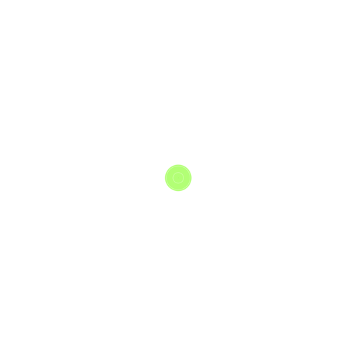
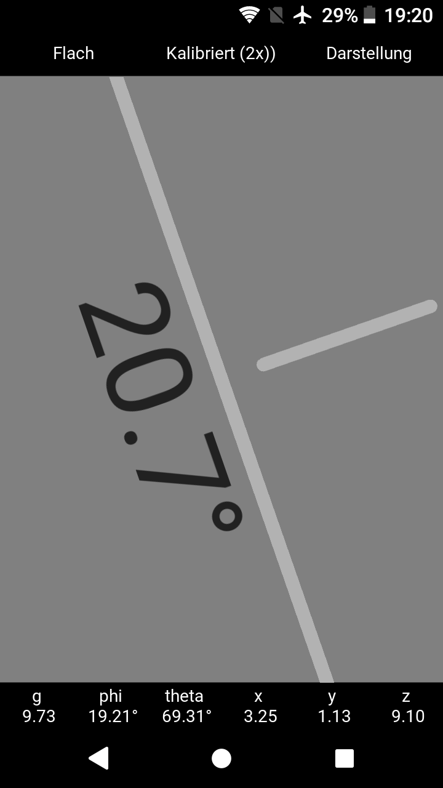
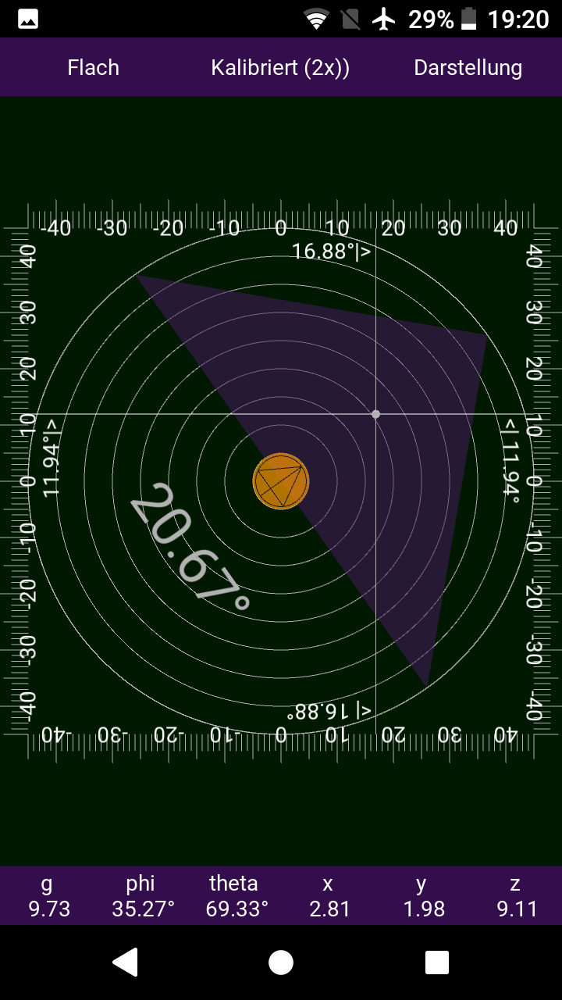

<!--

-->

# LBalance angle measurement app

This is another angle measuring app for android. It is written mainly
in Python using the Kivy framework. It offers different switchable
graphic layouts.

The app ist open source as of the GNU General Public License (see COPYING)

# Screenshots

