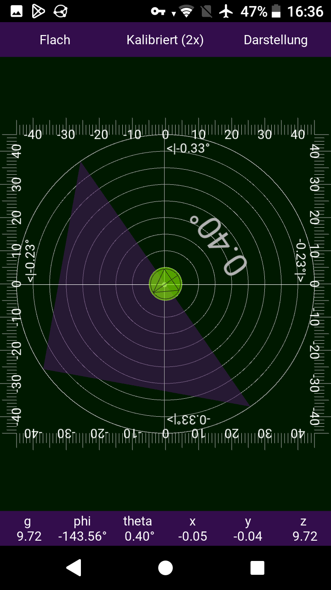

<!--

-->

# LBalance angle measurement app

This is another angle measuring app for android. It is written
in Python using the Kivy framework. It offers a number different
graphic layouts at users choice.

The app ist open source as of the GNU General Public License (see LICENSE)

# Usage

The app may be used to measure angles or as a level balance.

## Calibration

To calibrate the device to a given plane use the 'calibration' button in the
top bar. More than one value can be recorded. The correction value is
calculated from the average of all recorded values. Best results are obtained
by using 2 values taken before and after rotating the device 180 degrees
parallel to the contacting plane.

To reset calibration long tap onto the 'calibration' button.

## Layouts

To enumerate layouts tap to the button 'layouts' in the top bar.

## Angles display

Angles (polar coords) an sensor (cartesic coords) values are displayed also
in the bottom bar.

# Screenshots

